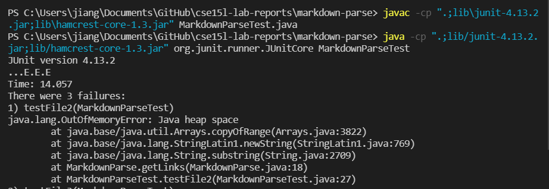
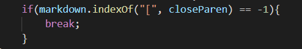
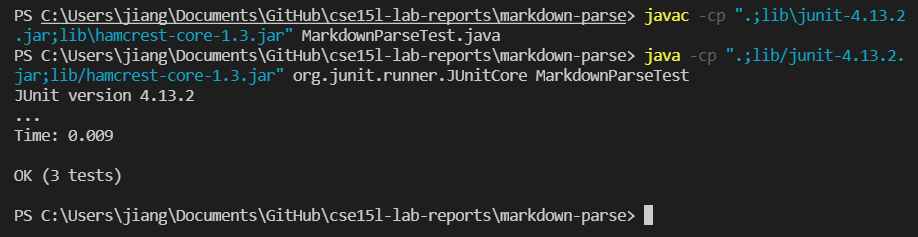
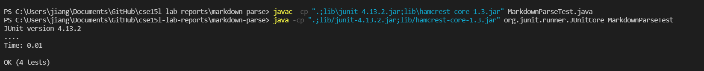
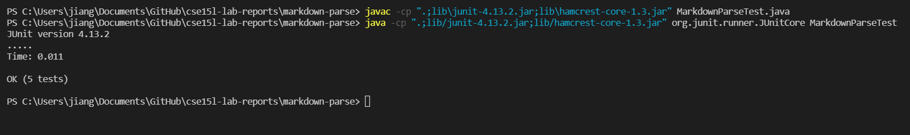

# lab report 2

Haochen Jiang

A17011224

## Bug 1

```
# Title

[a link!](https://something.com)12345
[another link!](some-page.html)123456

some paragraph text after the links
```
this is the first case that will cause error

The bug of test-file2.md is that it comes into infinite loop



the way to solve it is to add a break statement into the code



so the problem is solved



## Bug 2

```
# title 


```

this is the file that cause error, there is a ! before the `[`



the test passed after i debug the code in bug 1 case.

## Bug 3

```
[link][https://something.com]
```

this is the file that cause error

i think the reason is that the current method can not recognize `[]` for the second part

so i add a if statement to check how much `[` appears in the string

my current code:
```
// File reading code from https://howtodoinjava.com/java/io/java-read-file-to-string-examples/
import java.io.IOException;
import java.nio.file.Files;
import java.nio.file.Path;
import java.util.ArrayList;

public class MarkdownParse {
    public static ArrayList<String> getLinks(String markdown) {
        ArrayList<String> toReturn = new ArrayList<>();
        // find the next [, then find the ], then find the (, then take up to
        // the next )
        int currentIndex = 0;
        
        while(currentIndex < markdown.length()) {
            if(markdown.contains("(") == false){
                int nextOpenBracket = markdown.indexOf("[", currentIndex);
                int nextCloseBracket = markdown.indexOf("]", nextOpenBracket);
                int openParen = markdown.indexOf("[", nextCloseBracket);
                int closeParen = markdown.indexOf("]", openParen);
                toReturn.add(markdown.substring(openParen + 1, closeParen));
                if(markdown.indexOf("[", closeParen) == -1){
                    break;
                }
                currentIndex = closeParen + 1;
            }
            else{
                int nextOpenBracket = markdown.indexOf("[", currentIndex);
                int nextCloseBracket = markdown.indexOf("]", nextOpenBracket);
                int openParen = markdown.indexOf("(", nextCloseBracket);
                int closeParen = markdown.indexOf(")", openParen);
                toReturn.add(markdown.substring(openParen + 1, closeParen));
                if(markdown.indexOf("[", closeParen) == -1){
                    break;
                }
                currentIndex = closeParen + 1;
            }
        }
        return toReturn;
    }
    public static void main(String[] args) throws IOException {
		Path fileName = Path.of(args[0]);
	    String contents = Files.readString(fileName);
        ArrayList<String> links = getLinks(contents);
        System.out.println(links);
    }
}
```

the test passed successfully

